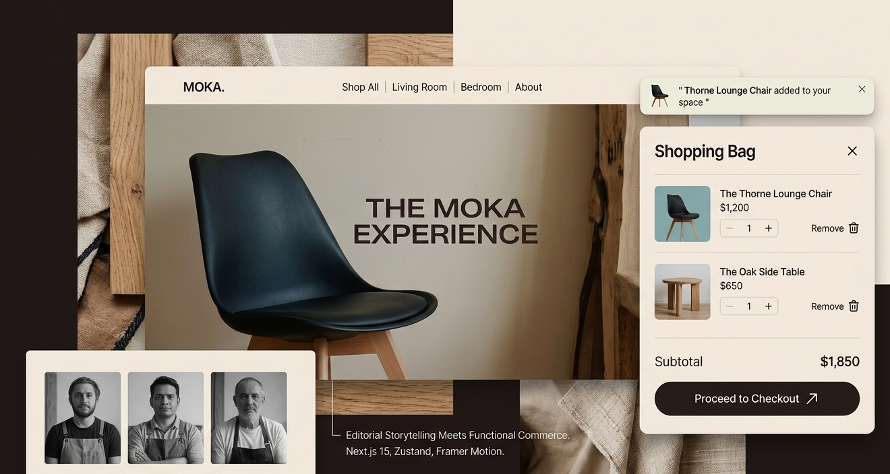

# MOKA — Minimalist Artisanal Furniture

Moka is a premium e-commerce experience built with **Next.js 15**, focused on high-end, slow furniture and the story behind artisanal craftsmanship. This platform demonstrates a seamless, responsive shopping journey, blending editorial design with a functional **Zustand**-powered cart and smooth **Framer Motion** interactivity.

---

## 🎨 Design Meets Function


> *A stylized visual overview of the Moka interface: The editorial Hero, the reactive Shopping Bag (Zustand), the 'Hot Toast' notification, and the artisan profiles ('Meet the Makers').*

---

## ✨ Key Features

The Moka platform is designed to emulate the "slow living" philosophy in its user experience:

* **Zustand Cart System**: A fully persistent shopping bag managed with Zustand state. Features predictive updates, local storage sync, quantity controls (+/-), and a "Hot Toast" notification system for user feedback.
* **Dynamic Product Routing**: Individual, dynamic detail pages for every piece in the collection (`products/[id]`), fetching specific data based on URL parameters.
* **Editorial Storytelling Layouts**: Integrated "About" (`/about`) and "Contact" (`/contact`) pages designed like high-end magazine spreads to emphasize brand narrative.
* **Framer Motion Interactivity**: Subtle staggered reveals and page transitions maintain a calm, premium aesthetic.
* **Next.js 15 Optimized**: Utilizing the App Router, asynchronous params, and performance features of Next.js 15.

---

## 🛠️ Tech Stack

Moka is built on modern, scalable technologies focused on speed and designer precision:

* **Framework**: [Next.js 15](https://nextjs.org/) (App Router, Server & Client Components)
* **Styling**: [Tailwind CSS](https://tailwindcss.com/)
* **State Management**: [Zustand](https://github.com/pmndrs/zustand)
* **Animations**: [Framer Motion](https://www.framer.com/motion/)
* **Icons**: [Lucide React](https://lucide.dev/)
* **Notifications**: [React Hot Toast](https://react-hot-toast.com/)

---

## 🚀 Getting Started

To get your own version of the Moka studio running locally, follow these steps:

**1. Clone the repository:**

```bash
git clone 
cd moka-furniture